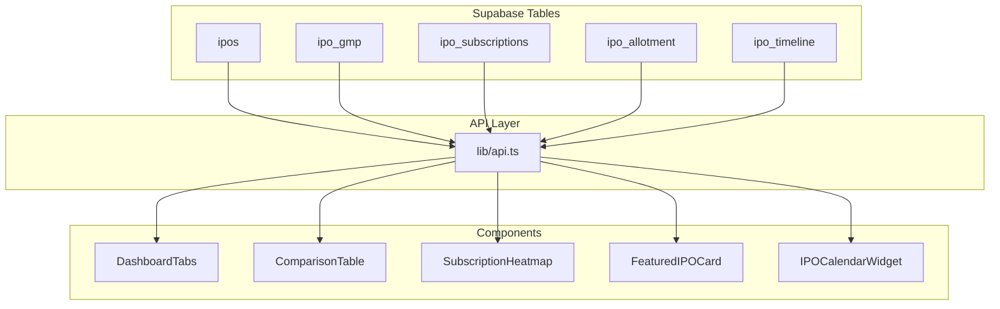

# Frontend Data Mapping Reference

This document maps each component and page to its data sources, API functions, and database columns.

---

## 📊 Data Flow Overview



---

## 🗄️ Database Tables & Columns Used

### Core Table: `ipos`

| Column                 | Type                 | Used By                         |
| ---------------------- | -------------------- | ------------------------------- |
| `id`                   | number               | All components (primary key)    |
| `ipo_name`             | string               | All components                  |
| `company_name`         | string               | All components                  |
| `slug`                 | string               | Links & navigation              |
| `category`             | 'SME' \| 'Mainboard' | Filters, badges                 |
| `status`               | string               | Filters, status badges          |
| `min_price`            | number               | Price band display              |
| `max_price`            | number               | Price band display              |
| `lot_size`             | number               | ComparisonTable, detail pages   |
| `issue_size_cr`        | number               | SubscriptionHeatmap, cards      |
| `open_date`            | string               | DashboardTabs, calendar         |
| `close_date`           | string               | DashboardTabs, countdown timers |
| `listing_date`         | string               | DashboardTabs (listed tab)      |
| `allotment_date`       | string               | AllotmentClient, detail page    |
| `registrar`            | string               | AllotmentClient                 |
| `listing_gain_percent` | number               | DashboardTabs (listed IPOs)     |
| `is_featured`          | boolean              | fetchFeaturedIPOs               |

### Related Table: `ipo_gmp`

| Column                    | Type    | Used By                  |
| ------------------------- | ------- | ------------------------ |
| `ipo_id`                  | number  | Foreign key to ipos      |
| `gmp_amount`              | number  | All GMP displays         |
| `gmp_percentage`          | number  | Percentage gain displays |
| `issue_price`             | number  | FeaturedIPOCard          |
| `estimated_listing_price` | number  | Expected listing         |
| `is_latest`               | boolean | Helper function filter   |

### Related Table: `ipo_subscriptions`

| Column                  | Type    | Used By                   |
| ----------------------- | ------- | ------------------------- |
| `ipo_id`                | number  | Foreign key to ipos       |
| `subscription_total`    | number  | All subscription displays |
| `subscription_retail`   | number  | Retail subscription       |
| `subscription_nii`      | number  | NII/sHNI subscription     |
| `subscription_qib`      | number  | QIB subscription          |
| `subscription_employee` | number  | SubscriptionHeatmap       |
| `is_latest`             | boolean | Helper function filter    |

### Related Table: `ipo_allotment`

| Column           | Type    | Used By               |
| ---------------- | ------- | --------------------- |
| `ipo_id`         | number  | Foreign key to ipos   |
| `registrar_link` | string  | AllotmentClient links |
| `is_active`      | boolean | Filter active links   |

### Related Table: `ipo_timeline`

| Column        | Type   | Used By             |
| ------------- | ------ | ------------------- |
| `ipo_id`      | number | Foreign key to ipos |
| `event_type`  | string | IPOCalendarWidget   |
| `event_date`  | string | Calendar display    |
| `event_title` | string | Event labels        |

---

## 📁 Pages Data Mapping

### `/` (index.astro)

**Location:** `src/pages/index.astro`

| API Function          | Data Used     | Columns                                      |
| --------------------- | ------------- | -------------------------------------------- |
| `fetchFeaturedIPOs()` | Featured IPOs | `ipos.*`, `ipo_gmp.*`, `ipo_subscriptions.*` |
| `fetchOpenIPOs()`     | Open IPOs     | `ipos.*`, `ipo_gmp.*`, `ipo_subscriptions.*` |

**Components Used:**
- `FeaturedIPOCard` - displays featured IPOs
- `DashboardTabs` - tabbed dashboard
- `ComparisonTable` - IPO comparison
- `SubscriptionHeatmap` - visual heatmap
- `IPOCalendarWidget` - calendar events

---

### `/ipo/[slug]` (IPO Detail Page)

**Location:** `src/pages/ipo/[slug].astro`

| API Function           | Data Used                     | Columns                |
| ---------------------- | ----------------------------- | ---------------------- |
| `fetchIPOBySlug(slug)` | Single IPO with all relations | All 15+ related tables |

**Key Fields Displayed:**
- GMP: `ipo_gmp.gmp_amount`, `ipo_gmp.gmp_percentage`
- Subscription: `ipo_subscriptions.subscription_*`
- Timeline: `ipo_timeline.event_*`
- Dates: `ipos.open_date`, `close_date`, `listing_date`

---

### `/gmp` (GMP Page)

**Location:** `src/pages/gmp.astro`

| API Function     | Data Used         | Columns                                      |
| ---------------- | ----------------- | -------------------------------------------- |
| `fetchGMPData()` | All IPOs with GMP | `ipos.*`, `ipo_gmp.*`, `ipo_subscriptions.*` |

**Component:** `GMPClient.tsx`

**Fields Used:**
```typescript
// From ipos table
ipo.ipo_name, ipo.company_name, ipo.slug, ipo.category, ipo.status
ipo.min_price, ipo.max_price, ipo.open_date, ipo.close_date

// From ipo_gmp (nested array)
latestGmp.gmp_amount
latestGmp.gmp_percentage

// From ipo_subscriptions (nested array)
latestSub.subscription_total
```

---

### `/upcoming-ipos` (Upcoming IPOs Page)

**Location:** `src/pages/upcoming-ipos.astro`

| API Function             | Data Used                     | Columns                                      |
| ------------------------ | ----------------------------- | -------------------------------------------- |
| `fetchCombinedIPOData()` | All upcoming/open/closed IPOs | `ipos.*`, `ipo_gmp.*`, `ipo_subscriptions.*` |

**Component:** `UpcomingIPOsClient.tsx`

---

### `/allotment` (Allotment Page)

**Location:** `src/pages/allotment.astro`

| API Function            | Data Used                    | Columns                                                   |
| ----------------------- | ---------------------------- | --------------------------------------------------------- |
| `fetchAllotmentLinks()` | Allotment data with IPO info | `ipo_allotment.*`, `ipos(ipo_name, slug, registrar, ...)` |

**Component:** `AllotmentClient.tsx`

**Fields Used:**
```typescript
// From ipo_allotment table
allotment.registrar_link
allotment.is_active

// From nested ipos data
allotment.ipos.ipo_name
allotment.ipos.slug
allotment.ipos.registrar
allotment.ipos.allotment_date
```

---

## 🧩 Component Data Mapping

### DashboardTabs.tsx

**Location:** `src/components/homepage/DashboardTabs.tsx`

| Tab                | API Function                | Status Filter         |
| ------------------ | --------------------------- | --------------------- |
| Currently Open     | `fetchOpenIPOs()`           | `status = 'open'`     |
| Recently Listed    | `fetchRecentlyListedIPOs()` | `status = 'listed'`   |
| Upcoming This Week | `fetchUpcomingThisWeek()`   | `status = 'upcoming'` |
| Closed             | `fetchClosingSoonIPOs()`    | `status = 'closed'`   |

**Fields Displayed per Card:**
```typescript
ipo.company_name || ipo.ipo_name  // Name
ipo.category                       // SME/Mainboard badge
ipo.close_date                     // Days left calculation
latestGmp.gmp_amount              // GMP value
latestGmp.gmp_percentage          // GMP percentage
latestSub.subscription_total      // Subscription multiplier
ipo.listing_gain_percent          // For listed IPOs
```

---

### ComparisonTable.tsx

**Location:** `src/components/homepage/ComparisonTable.tsx`

| API Function                          | Filters                  |
| ------------------------------------- | ------------------------ |
| `fetchAllIPOsForComparison(category)` | Optional category filter |

**Table Columns:**
| Column       | Source                           |
| ------------ | -------------------------------- |
| Company      | `ipo.company_name`               |
| Category     | `ipo.category`                   |
| Price Band   | `ipo.min_price`, `ipo.max_price` |
| GMP          | `latestGmp.gmp_amount`           |
| % Gain       | `latestGmp.gmp_percentage`       |
| Lot Size     | `ipo.lot_size`                   |
| Subscription | `latestSub.subscription_total`   |
| Open Date    | `ipo.open_date`                  |
| Close Date   | `ipo.close_date`                 |

---

### SubscriptionHeatmap.tsx

**Location:** `src/components/homepage/SubscriptionHeatmap.tsx`

| API Function             |
| ------------------------ |
| `fetchCombinedIPOData()` |

**Metrics Available:**
| Metric       | Column Source                         |
| ------------ | ------------------------------------- |
| IPO Size     | `ipo.issue_size_cr`                   |
| GMP Percent  | `latestGmp.gmp_percentage`            |
| Retail Sub   | `latestSub.subscription_retail`       |
| sHNI Sub     | `latestSub.subscription_nii * 0.5`    |
| bHNI Sub     | `latestSub.subscription_nii * 0.5`    |
| Employee Sub | `latestSub.subscription_employee`     |
| Total Sub    | `latestSub.subscription_total`        |
| Listing Gain | `ipo.listing_gain_percent`            |
| Price Band   | `(ipo.min_price + ipo.max_price) / 2` |

---

### FeaturedIPOCard.tsx

**Location:** `src/components/homepage/FeaturedIPOCard.tsx`

| Field          | Source                                     |
| -------------- | ------------------------------------------ |
| Company Name   | `ipo.company_name \|\| ipo.ipo_name`       |
| Category Badge | `ipo.category`                             |
| Status         | `ipo.status`                               |
| GMP            | `latestGmp.gmp_amount`                     |
| Expected Gain  | `latestGmp.gmp_percentage`                 |
| Subscription   | `latestSub.subscription_total`             |
| Retail Sub     | `latestSub.subscription_retail`            |
| Timer          | `ipo.close_date` or `ipo.open_date`        |
| Issue Price    | `latestGmp.issue_price \|\| ipo.max_price` |

---

### GMPClient.tsx

**Location:** `src/components/GMPClient.tsx`

| Field        | Source                               |
| ------------ | ------------------------------------ |
| IPO Name     | `ipo.company_name \|\| ipo.ipo_name` |
| Category     | `ipo.category`                       |
| Status       | `ipo.status`                         |
| Price Band   | `ipo.min_price`, `ipo.max_price`     |
| GMP          | `latestGmp.gmp_amount`               |
| GMP %        | `latestGmp.gmp_percentage`           |
| Subscription | `latestSub.subscription_total`       |
| Dates        | `ipo.open_date`, `ipo.close_date`    |

---

### AllotmentClient.tsx

**Location:** `src/components/AllotmentClient.tsx`

| Field          | Source                          |
| -------------- | ------------------------------- |
| IPO Name       | `allotment.ipos.ipo_name`       |
| Registrar      | `allotment.ipos.registrar`      |
| Link           | `allotment.registrar_link`      |
| Allotment Date | `allotment.ipos.allotment_date` |
| Status         | `allotment.ipos.status`         |
| Category       | `allotment.ipos.category`       |

---

### IPOCalendarWidget.tsx

**Location:** `src/components/homepage/IPOCalendarWidget.tsx`

| API Function                       |
| ---------------------------------- |
| `fetchCalendarEvents(year, month)` |

**Data Source:** `ipo_timeline` table

| Field       | Source              |
| ----------- | ------------------- |
| Event Date  | `event.event_date`  |
| Event Title | `event.event_title` |
| Event Type  | `event.event_type`  |
| IPO Slug    | `event.ipos.slug`   |

---

## 🔧 Helper Functions

### getLatestGmp(gmpRecords)

```typescript
// Finds the latest GMP from nested ipo_gmp array
// Looks for is_latest = true, or returns first record
const latestGmp = getLatestGmp(ipo.ipo_gmp);
```

### getLatestSubscription(subRecords)

```typescript
// Finds the latest subscription from nested ipo_subscriptions array
// Looks for is_latest = true, or returns first record
const latestSub = getLatestSubscription(ipo.ipo_subscriptions);
```

---

## 📝 Quick Reference: How to Find Data Source

1. **Find the page** in `src/pages/`
2. **Look at imports** - which API functions are imported from `lib/api.ts`
3. **Check the component** - what fields it accesses from the data
4. **Trace to api.ts** - see the Supabase query and which tables are joined
5. **Check supabase.ts** - see the TypeScript interface for the table structure
